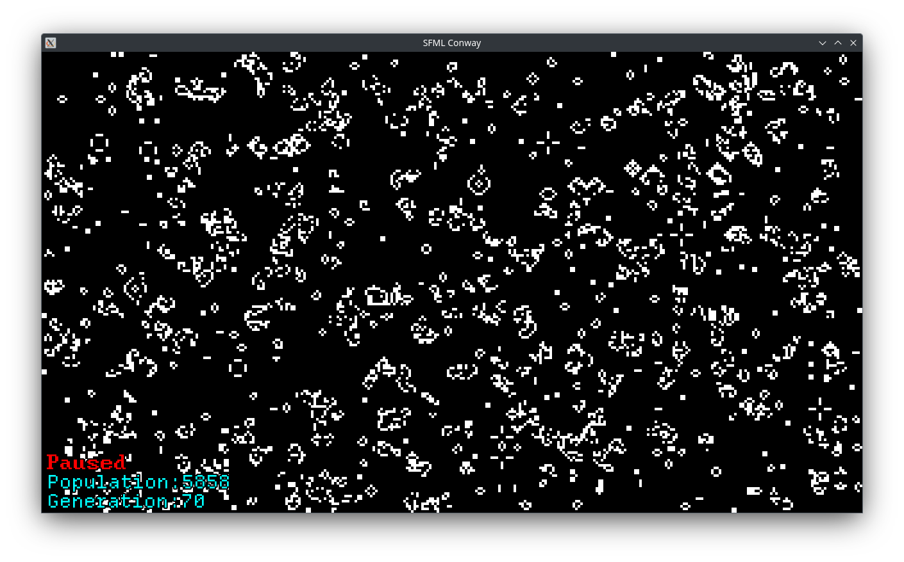

# SFML Conway

Very simple Conway Game of Life Simulator written in C++

This was my very first programming project in 2021, but it got lost so I remade it

Features to be implemented:
- Unit constructors: statics, oscillators and spaceships
- User interaction
- GUI
- Custom world loading
- Split simulation speed and framerate
- Consider the left-right and up-down edges to be together like a toroidal array

[See about Conway Game of Life (Wikipedia)](https://en.wikipedia.org/wiki/Conway%27s_Game_of_Life)